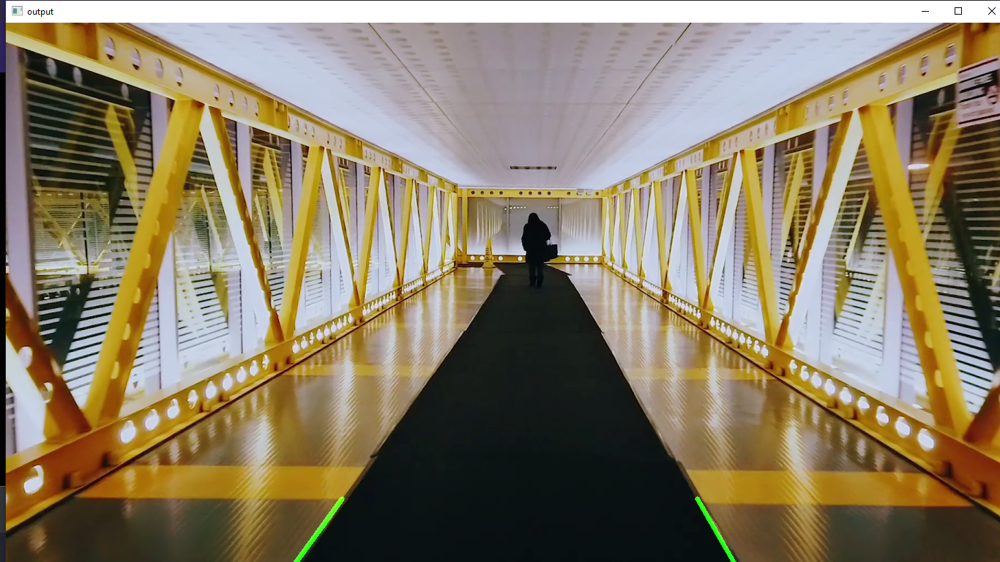

# Lane Detection

The aim of this project was to build a program that can detect left and right lanes of any given path without using any Deep learning Model. 
The standard approach for lane detection tasks usually involve Image Segmentation done by training a deep learning NN/CNN based model on large amounts of data. The problems with this approach are:
1. High amount of training time required
2. Greater inference time of the deep model because of large number of layers
3. For good accuracy a large well annotated dataset is required
4. Biased induced by the dataset

With this project I intend to build a model that doesnt require any data to train, has low inference time and generalizes better.
The main aim of this project was to build a lane detection model for the purpose of using on IOT devices with limited memory and processing power.
This program uses the following Computer Vision techniques for the purpose of identifying lanes in an image:
* Gauusian Blurring
* Canny Edge detection
* Image Segmenting
* Hough Transform

The following libraries were used for this project:
* cv2
* Numpy
* Matplotlib

## Throughput
The model computed lanes for 100 images of average esolution 351*532 in 1.498 s on a standard CPU based computer. Giving a throughput of 67.11 img/sec.

## To Run the program clone this repository and use the command "python lane.py"

## Sample Output
